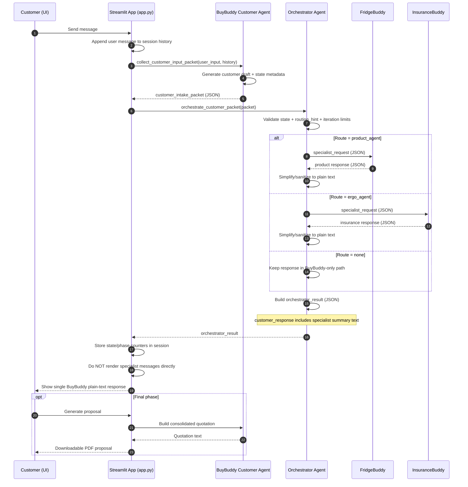

# Agentic AI Innovation - BuyBuddy Multi-Agent System

An intelligent Streamlit application where customers interact with a customer-facing BuyBuddy, while a backend BuyBuddy orchestrator coordinates specialized teams (Product and Insurance).

## 🤖 Agent Architecture

### BuyBuddy Customer-Facing Agent 🤖
- **Role**: Main customer-facing agent
- **Function**: 
  - Directly handles all customer interactions
  - Analyzes customer queries to understand their needs
   - Sends structured intake packet to BuyBuddy Orchestrator
   - Presents final summarized response to customer
  - Maintains conversation context and history
- **Display**: Shows coordination process and specialist consultations
- **Advantages**: 
  - Single point of contact for customers
   - Clear separation of customer interaction vs orchestration
  - Context-aware responses
  - Efficient query handling

### BuyBuddy Orchestrator Agent ⚙️
- **Role**: Backend orchestration agent
- **Function**:
   - Receives JSON packet from customer-facing BuyBuddy
   - Routes requests to FridgeBuddy / InsuranceBuddy
   - Enforces iteration and validation rules
   - Returns JSON result with specialist outputs and response summary

### Specialist Agents (Support Teams)

1. **Product Agent** 🏭
   - Consulted for: production, assembly, inventory, supply chain, factory processes, capacity
   - Provides specialist input when product topics are mentioned

2. **Insurance Agent** 💰
   - Consulted for: costs, pricing, budget, revenue, profit, expenses, investments, ROI
   - Provides specialist input when insurance/financial topics are mentioned

## 🔄 Architecture Flow



## 🚀 Features

- ✅ **Direct Customer Interaction** - Customers chat directly with Retail Agent
- ✅ **Smart Coordination** - Retail Agent automatically consults specialists when needed
- ✅ **Context-Aware** - Maintains conversation history for better responses
- ✅ **Transparent Process** - See when and why specialists are consulted
- ✅ **Proposal Generation** - Create PDF proposals from conversations
- ✅ **Floating bot icon** with animation
- ✅ **Chat history** with reset functionality
- ✅ **Azure AI integration** with cloud-first credentials (`DefaultAzureCredential` + local fallback)
- ✅ **Agent status monitoring** in sidebar
- ✅ **Graceful fallbacks** - Works even if specialist agents aren't configured

## 📦 Installation

1. **Clone the repository**
   ```bash
   git clone https://github.com/an-amateur-person/Agentic-AI-Innovation.git
   cd Agentic-AI-Innovation
   ```

2. **Create virtual environment**
   ```bash
   python -m venv .venv
   ```

3. **Activate virtual environment**
   
   Windows PowerShell:
   ```bash
   Set-ExecutionPolicy -ExecutionPolicy Bypass -Scope Process
   .\.venv\Scripts\Activate.ps1
   ```
   
   Or directly run without activation:
   ```bash
   .\.venv\Scripts\python.exe -m pip install -r requirements.txt
   ```

4. **Install dependencies**
   ```bash
   pip install -r requirements.txt
   ```

5. **Configure environment**
   ```bash
   cp .env.example .env
   ```
   
   Edit `.env` and add your Azure credentials:
   - `AZURE_TENANT_ID` - Your Azure tenant ID
   - `AZURE_SUBSCRIPTION_ID` - Your Azure subscription ID
   - `AZURE_AIPROJECT_ENDPOINT` - Your Azure AI project endpoint
   - `AZURE_LOCATION` - Azure region (e.g., swedencentral)
   - `AGENT_RETAIL` - Retail Agent name (primary)
   - `AGENT_PRODUCT` - Product Agent name (specialist)
   - `AGENT_INSURANCE` - Insurance Agent name (specialist)

## 🏃 Running the Application

```bash
.\.venv\Scripts\streamlit.exe run app.py
```

Or if virtual environment is activated:
```bash
streamlit run app.py
```

The app will open at `http://localhost:8501`

## 🔐 Authentication

The application uses `DefaultAzureCredential` first, with `InteractiveBrowserCredential` fallback for local development.

1. In hosted/cloud environments, managed identity or environment-based identity is used automatically.
2. In local development, browser sign-in fallback is used when needed.
3. Ensure your identity has access to the Azure AI resources.

## 📁 Project Structure

```
Agentic-AI-Innovation/
├── app.py                        # Main Streamlit application (BuyBuddy customer + orchestrator flow)
├── requirements.txt              # Python dependencies
├── .env                          # Environment configuration (not in git)
├── .env.example                  # Environment template
├── .gitignore                    # Git ignore rules
├── agents/
│   ├── retail_agent.py           # retail_agent customer-facing layer
│   ├── retail_orchestrator_agent.py # retail_agent backend orchestration layer
│   ├── product_agent.py          # Product specialist (support)
│   ├── insurance_agent.py        # Insurance specialist (support)
│   └── utilities.py              # Shared auth + BuyBuddy parsing/validation/icon utilities
└── .venv/                        # Virtual environment
```

**Note:** 
- `.env` contains your actual credentials and is excluded from git
- Inter-agent exchange between BuyBuddy layers and specialists is JSON-based
- All hardcoded values have been removed - everything uses environment variables

## 💡 Usage Examples

**Retail Inquiry:**
```
"Tell me about the features of your latest product"
```
→ Retail Agent responds directly

**Product Question:**
```
"What's the production timeline and capacity for bulk orders?"
```
→ Retail Agent consults Product specialist and provides comprehensive answer

**Financial Inquiry:**
```
"What's the pricing for enterprise licensing?"
```
→ Retail Agent consults Insurance specialist and provides detailed pricing

**Combined Query:**
```
"Can you produce 10,000 units and what would the cost be?"
```
→ Retail Agent consults both Product and Insurance specialists

## 🛠️ How It Works

### Query Flow

1. **Customer asks a question** → Retail Agent receives it
2. **Analysis** → Retail Agent analyzes if specialist input is needed
3. **Coordination** → Consults Product/Insurance agents if relevant topics detected
4. **Response** → Retail Agent synthesizes all information into comprehensive answer

### Specialist Detection

Retail Agent automatically detects when to consult specialists based on keywords:
- **Product**: production, inventory, supply, operations, capacity, assembly
- **Insurance**: cost, price, budget, revenue, expense, investment, ROI

## 📊 Agent Status

The sidebar displays real-time status of all agents:
- ✅ Green: Agent initialized successfully (Retail Agent is required)
- ⚠️ Yellow: Specialist not configured (system still works, limited capabilities)
- ❌ Red: Initialization error

**Agent Roles:**
- **Retail Agent (Primary)** - Must be configured for system to work
- **Product & Insurance (Specialists)** - Optional, consulted when needed

## 🎯 Key Changes from Previous Version

- ❌ **Removed**: Analysis Agent / Orchestrator - no longer needed
- ✅ **Simplified**: Direct customer → Retail Agent interaction
- ✅ **Enhanced**: Retail Agent now coordinates with specialists automatically
- ✅ **Improved**: Single conversation thread, better context retention
- ✅ **Streamlined**: Reduced complexity, faster responses

## 🤝 Contributing

1. Fork the repository
2. Create a feature branch
3. Make your changes
4. Submit a pull request

## 📝 License

MIT License - feel free to use and modify

## 🆘 Troubleshooting

**Streamlit command not found:**
```bash
.\.venv\Scripts\streamlit.exe run app.py
```

**PowerShell execution policy error:**
```bash
Set-ExecutionPolicy -ExecutionPolicy Bypass -Scope Process
```

**Authentication errors:**
- Ensure you're logged in with the correct tenant
- Check `AZURE_TENANT_ID` in `.env`
- Verify you have access to the Azure AI resources
- Make sure `.env` file exists and is properly configured

**Missing environment variables:**
- Copy `.env.example` to `.env`
- Fill in all required values
- Never commit `.env` to git (it's in .gitignore)

**Retail Agent not responding:**
- Verify `AGENT_RETAIL` is correctly set in `.env`
- Check that the agent exists in your Azure AI project
- Specialist agents are optional - system works without them but with reduced capabilities

---

Built with ❤️ using Streamlit and Azure AI
