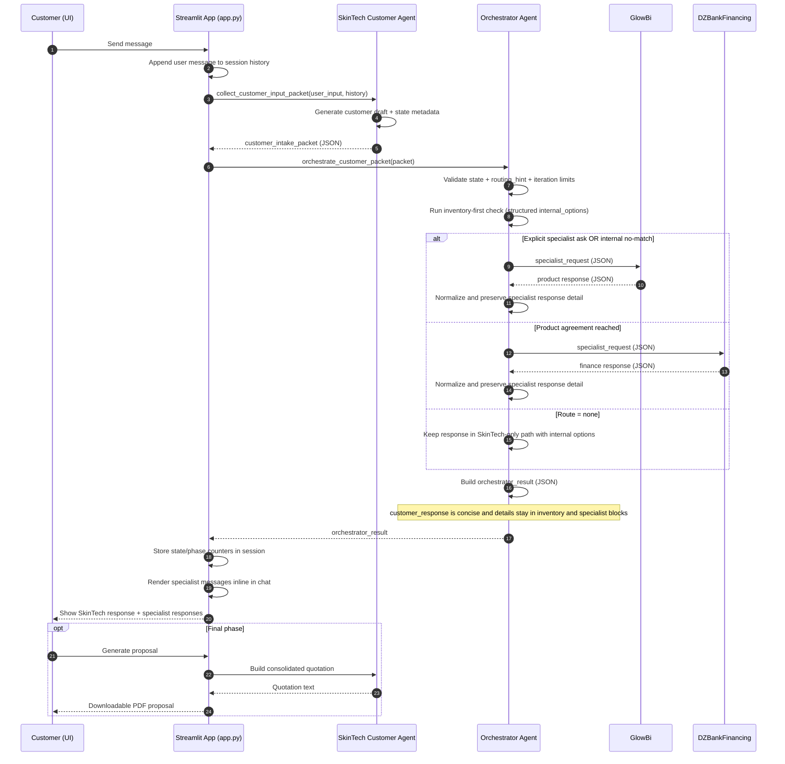

# Agentic AI Innovation - SkinTech Multi-Agent System

An intelligent Streamlit application where customers interact with a customer-facing SkinTech assistant, while a backend orchestrator coordinates specialized teams (Product and Finance).

## 🤖 Agent Architecture

### SkinTech Customer-Facing Agent 🤖
- **Role**: Main customer-facing agent
- **Function**: 
  - Directly handles all customer interactions
  - Analyzes customer queries to understand their needs
   - Sends structured intake packet to the Orchestrator
   - Presents final summarized response to customer
  - Maintains conversation context and history
- **Display**: Shows coordination process and specialist consultations
- **Advantages**: 
  - Single point of contact for customers
   - Clear separation of customer interaction vs orchestration
  - Context-aware responses
  - Efficient query handling

### Orchestrator Agent ⚙️
- **Role**: Backend orchestration agent
- **Function**:
   - Receives JSON packet from customer-facing SkinTech
   - Runs internal inventory-first checks and returns structured inventory payloads
   - Routes requests to GlowBi / DZBankFinancing
   - Enforces iteration and validation rules
   - Returns JSON result with specialist outputs and response summary

### Specialist Agents (Support Teams)

1. **Product Agent** 🏭
   - Consulted for: beauty-tech product recommendations, specs, pricing, compatibility, and availability
   - Provides specialist product input when internal inventory cannot fully satisfy the request or user explicitly asks

2. **Finance Agent** 💰
   - Consulted for: beauty-tech protection plans, premium calculation, eligibility, and coverage options
   - Provides specialist finance input after product agreement / finance phase

## 🔄 Architecture Flow


```mermaid
sequenceDiagram
   autonumber
   participant U as Customer (UI)
   participant A as Streamlit App (app.py)
   participant B as SkinTech Customer Agent
   participant O as Orchestrator Agent
   participant P as GlowBi
   participant I as DZBankFinancing

   U->>A: Send message
   A->>A: Append user message to session history

   A->>B: collect_customer_input_packet(user_input, history)
   B->>B: Generate customer draft + state metadata
   B-->>A: customer_intake_packet (JSON)

   A->>O: orchestrate_customer_packet(packet)
   O->>O: Validate state + routing_hint + iteration limits
   O->>O: Run inventory-first check (structured internal_options)

   alt Explicit specialist ask OR internal no-match
      O->>P: specialist_request (JSON)
      P-->>O: product response (JSON)
      O->>O: Normalize and preserve specialist response detail
   else Product agreement reached
      O->>I: specialist_request (JSON)
      I-->>O: finance response (JSON)
      O->>O: Normalize and preserve specialist response detail
   else Route = none
      O->>O: Keep response in SkinTech-only path with internal options
   end

   O->>O: Build orchestrator_result (JSON)
   Note over O: customer_response is concise and details stay in inventory and specialist blocks
   O-->>A: orchestrator_result

   A->>A: Store state/phase counters in session
   A->>A: Render specialist messages inline in chat
   A-->>U: Show SkinTech response + specialist responses

   opt Final phase
      U->>A: Generate proposal
      A->>B: Build consolidated quotation
      B-->>A: Quotation text
      A-->>U: Downloadable PDF proposal
   end
```

## 🚀 Features

- ✅ **Direct Customer Interaction** - Customers chat directly with SkinTech
- ✅ **Smart Coordination** - SkinTech orchestrates specialist consultations when needed
- ✅ **Context-Aware** - Maintains conversation history for better responses
- ✅ **Transparent Process** - See when and why specialists are consulted
- ✅ **Inventory-first flow** - Internal options are attempted before specialist fallback
- ✅ **Proposal Generation** - Create PDF proposals from conversations
- ✅ **Floating bot icon** with animation
- ✅ **Chat history** with reset functionality
- ✅ **Azure AI integration** with cloud-first credentials (`DefaultAzureCredential` + local fallback)
- ✅ **Agent status monitoring** in sidebar (no diagnostics controls in UI)
- ✅ **Graceful fallbacks** - Works even if specialist agents aren't configured

## 📦 Installation

1. **Clone the repository**
   ```bash
   git clone https://github.com/an-amateur-person/Agentic-AI-Innovation.git
   cd Agentic-AI-Innovation
   ```

2. **Create virtual environment**
   ```bash
   python -m venv .venv
   ```

3. **Activate virtual environment**
   
   Windows PowerShell:
   ```bash
   Set-ExecutionPolicy -ExecutionPolicy Bypass -Scope Process
   .\.venv\Scripts\Activate.ps1
   ```
   
   Or directly run without activation:
   ```bash
   .\.venv\Scripts\python.exe -m pip install -r requirements.txt
   ```

4. **Install dependencies**
   ```bash
   pip install -r requirements.txt
   ```

5. **Configure environment**
   ```bash
   cp .env.example .env
   ```
   
   Edit `.env` and add your Azure credentials:
   - `AZURE_TENANT_ID` - Your Azure tenant ID
   - `AZURE_SUBSCRIPTION_ID` - Your Azure subscription ID
   - `AZURE_AIPROJECT_ENDPOINT` - Your Azure AI project endpoint
   - `AZURE_LOCATION` - Azure region (e.g., swedencentral)
   - `AGENT_RETAIL` - SkinTech customer-facing agent name
   - `AGENT_ORCHESTRATOR` - Orchestrator agent name
   - `AGENT_PRODUCT` - Product specialist agent name
   - `AGENT_FINANCE` - Finance specialist agent name

## 🏃 Running the Application

```bash
.\.venv\Scripts\streamlit.exe run app.py
```

Or if virtual environment is activated:
```bash
streamlit run app.py
```

The app will open at `http://localhost:8501`

## 🔐 Authentication

The application uses `DefaultAzureCredential` first, with `InteractiveBrowserCredential` fallback for local development.

1. In hosted/cloud environments, managed identity or environment-based identity is used automatically.
2. In local development, browser sign-in fallback is used when needed.
3. Ensure your identity has access to the Azure AI resources.

## 📁 Project Structure

```
Agentic-AI-Innovation/
├── app.py                        # Main Streamlit application (SkinTech customer + orchestrator flow)
├── requirements.txt              # Python dependencies
├── .env                          # Environment configuration (not in git)
├── .env.example                  # Environment template
├── .gitignore                    # Git ignore rules
├── agents/
│   ├── retail_agent.py           # retail_agent customer-facing layer
│   ├── retail_orchestrator_agent.py # retail_agent backend orchestration layer
│   ├── product_agent.py          # Product specialist (support)
│   ├── finance_agent.py          # Finance specialist interface
│   └── utilities.py              # Shared auth + parsing/validation/icon utilities
└── .venv/                        # Virtual environment
```

**Note:** 
- `.env` contains your actual credentials and is excluded from git
- Inter-agent exchange between SkinTech layers and specialists is JSON-based
- Runtime configuration uses environment variables for endpoints/agent names; customer-facing copy may still include fixed default text.

## 💡 Usage Examples

**Initial Intake:**
```
"beauty tech device"
```
→ SkinTech asks focused clarifying questions (region, budget, type)

**Inventory-First Product Search:**
```
"looking for a beauty tech device in munich, budget around 1000"
```
→ Orchestrator runs internal inventory check and returns structured internal options

**Explicit Specialist Escalation:**
```
"refer to GlowBi"
```
→ Orchestrator routes to GlowBi for specialist recommendations

**Finance Phase:**
```
"yes, add financing"
```
→ Orchestrator routes to DZBankFinancing with product context for coverage/pricing

## 🛠️ How It Works

### Query Flow

1. **Customer asks a question** → SkinTech receives it
2. **Analysis** → SkinTech prepares intake packet and state metadata
3. **Orchestration** → Inventory-first check, then specialist routing only when policy allows
4. **Response** → SkinTech response plus inline specialist/internal inventory blocks

### Routing Policy

The orchestrator applies prompt-driven routing:
- **GlowBi**: used as fallback when internal no-match is confirmed, or when user explicitly asks to refer/escalate
- **DZBankFinancing**: used after product agreement / finance phase transition
- **Inventory check**: always represented via `inventory_check` block with structured `internal_options` or `no_match_reason`

## 📊 Agent Status

The sidebar displays real-time status of all agents:
- ✅ Green: Agent initialized successfully (SkinTech customer + orchestrator are primary)
- ⚠️ Yellow: Specialist not configured (system still works, limited capabilities)
- ❌ Red: Initialization error

**Agent Roles:**
- **SkinTech Customer + Orchestrator (Primary)** - Required for full system behavior
- **Product & Finance (Specialists)** - Optional, consulted when needed

## 🎯 Current Design Notes

- ✅ **Split architecture**: SkinTech customer-facing + orchestrator
- ✅ **JSON inter-agent protocol** for internal coordination
- ✅ **SkinTech response + specialist responses** shown inline in UI
- ✅ **Context retention** with state + iteration tracking
- ✅ **Prompt-driven parsing/routing preference** (minimal UI-side keyword hard-coding)

## 🤝 Contributing

1. Fork the repository
2. Create a feature branch
3. Make your changes
4. Submit a pull request

## 📝 License

MIT License - feel free to use and modify

## 🆘 Troubleshooting

**Streamlit command not found:**
```bash
.\.venv\Scripts\streamlit.exe run app.py
```

**PowerShell execution policy error:**
```bash
Set-ExecutionPolicy -ExecutionPolicy Bypass -Scope Process
```

**Authentication errors:**
- Ensure you're logged in with the correct tenant
- Check `AZURE_TENANT_ID` in `.env`
- Verify you have access to the Azure AI resources
- Make sure `.env` file exists and is properly configured

**Missing environment variables:**
- Copy `.env.example` to `.env`
- Fill in all required values
- Never commit `.env` to git (it's in .gitignore)

**SkinTech/agents not responding:**
- Verify `AGENT_RETAIL` is correctly set in `.env`
- Verify `AGENT_ORCHESTRATOR` is correctly set in `.env`
- Check that the agent exists in your Azure AI project
- Specialist agents are optional - system works without them but with reduced capabilities

---

Built with ❤️ using Streamlit and Azure AI
